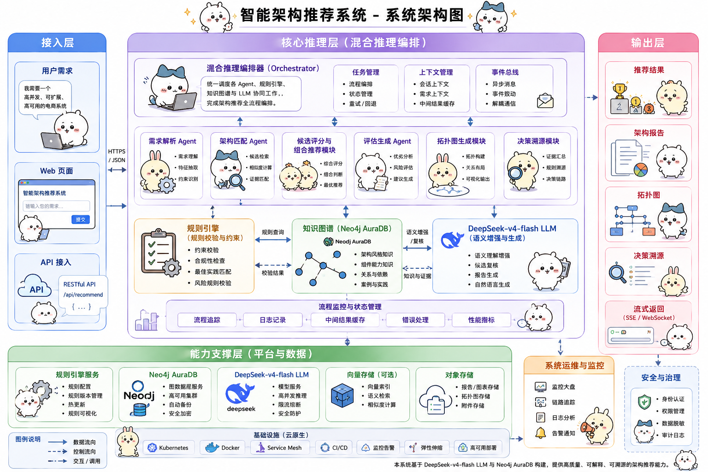
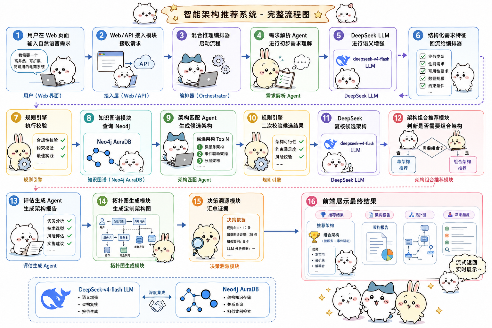

# ArchWise | 基于 FastAPI + Neo4j + DeepSeek LLM 的软件体系结构风格智能助手

ArchWise 是一个面向软件架构设计场景的智能推荐系统，能够根据用户自然语言需求自动完成需求理解、架构风格推荐、多维度对比分析、决策溯源和定制架构拓扑图生成。

## 项目背景

在软件系统设计早期，开发者通常需要根据业务规模、并发压力、实时性、可靠性、扩展性、数据流特征和部署约束选择合适的软件体系结构风格。传统方式依赖人工经验，容易出现判断主观、依据不清晰、候选方案对比不足等问题。

ArchWise 的目标是将“自然语言需求”转化为“结构化架构决策”，通过大语言模型、规则引擎、知识图谱和多 Agent 协作，为用户提供可解释、可追溯、可视化的架构推荐结果。

适用场景包括：

- 软件体系结构课程作业
- 架构风格选型辅助
- 需求到架构映射演示
- 多架构方案对比分析
- 架构设计早期原型验证

## 主要功能

- 需求理解：从自然语言需求中提取业务领域、关键词、并发、实时性、可靠性、扩展性、数据流和部署约束。
- 架构推荐：根据需求特征推荐分层、微服务、事件驱动、CQRS、Serverless 等候选架构风格。
- 多维度对比：从性能、扩展性、可靠性、可维护性、实时性、复杂度等维度生成对比矩阵。
- 最终评估报告：输出最终推荐架构、推荐理由、优缺点、风险和落地建议。
- 混合推理：结合规则引擎、DeepSeek LLM 和 Neo4j 知识图谱进行协同决策。
- 架构组合推荐：判断是否需要组合架构，并说明核心架构和辅助架构各自负责的部分。
- 定制拓扑图：根据需求生成 Mermaid 架构拓扑图，支持展示组件关系和架构模式职责映射。
- 决策溯源：展示需求特征、规则命中、知识图谱证据、评分依据和 LLM 复核意见。
- 知识库扩展：支持扩展架构风格、领域能力、组件关系和典型案例。
- 流式输出：评估报告支持 Server-Sent Events 流式生成，提升交互体验。

## 技术栈

| 维度 | 技术 |
| --- | --- |
| 后端 | Python、FastAPI、Pydantic |
| 前端 | HTML、CSS、JavaScript |
| 可视化 | Mermaid |
| 大语言模型 | DeepSeek API，OpenAI-compatible Chat Completions |
| 知识图谱 | Neo4j AuraDB |
| 推理机制 | 多 Agent 协作、规则引擎、LLM 协同推理 |
| 数据交互 | REST API、Server-Sent Events |
| 配置管理 | python-dotenv |
| 测试 | pytest |

## 系统架构



说明：实线箭头表示正向调用、调度或查询；虚线箭头表示结果返回、数据回流或前端展示。

## 核心流程



## 环境依赖与前置条件

运行项目前建议准备以下环境：

- Python 3.11 或更高版本
- pip 包管理工具
- DeepSeek API Key，可选；未配置时系统会使用本地规则和模板兜底
- Neo4j AuraDB 实例，可选；未配置时系统仍可使用本地知识库运行

主要 Python 依赖：

- fastapi
- uvicorn
- pydantic
- httpx
- jinja2
- python-dotenv
- neo4j
- pytest

## 快速部署与运行

### 1. 拉取项目

```bash
git clone <your-repository-url>
cd ArchWise
```

### 2. 安装依赖

```bash
pip install -r requirements.txt
```

### 3. 配置环境变量

复制环境变量模板：

```bash
cp .env.example .env
```

Windows PowerShell 可使用：

```powershell
Copy-Item .env.example .env
```

DeepSeek 配置：

```env
LLM_API_KEY=你的 DeepSeek API Key
LLM_BASE_URL=https://api.deepseek.com
LLM_MODEL=deepseek-chat
LLM_TIMEOUT_SECONDS=12
```

Neo4j AuraDB 配置：

```env
NEO4J_URI=neo4j+s://<你的实例ID>.databases.neo4j.io
NEO4J_USER=neo4j
NEO4J_PASSWORD=你的 AuraDB 密码
NEO4J_DATABASE=neo4j
```

### 4. 启动服务

```bash
python -m uvicorn app.main:app --host 127.0.0.1 --port 8000 --reload
```

### 5. 访问系统

- Web 页面：http://127.0.0.1:8000
- API 文档：http://127.0.0.1:8000/docs
- 健康检查：http://127.0.0.1:8000/health

### 6. 初始化 Neo4j 知识图谱

如果配置了 Neo4j AuraDB，可在服务启动后访问 API 文档，调用以下接口同步知识库：

```text
POST /api/knowledge/neo4j/sync
```

可通过以下接口检查 Neo4j 连接状态：

```text
GET /api/knowledge/neo4j/status
```

## 项目目录结构

```text
ArchWise/
  app/
    agents/                 # 需求解析、架构匹配、评估生成 Agent
    knowledge/              # 架构风格知识库
    models/                 # 数据模型
    services/               # LLM、规则引擎、Neo4j、编排器、拓扑生成等服务
    static/                 # 前端静态资源
    templates/              # 页面模板
    main.py                 # FastAPI 应用入口
  data/
    rules.json              # 规则库
    domain_topology.json    # 领域能力与拓扑知识
    test_cases.json         # 典型需求案例
  docs/
    需求规格说明书.md
    架构设计文档.md
    系统测试报告.md
  tests/
    test_recommendation.py
    test_topology_generator.py
  requirements.txt
  .env.example
  README.md
```

## 项目亮点

- LLM + 知识图谱双驱动：DeepSeek 负责语义理解和报告生成，Neo4j 负责结构化架构知识组织。
- 多 Agent 协作：需求解析、架构匹配、评估生成等 Agent 分阶段协作完成架构推荐。
- 规则引擎兜底：对高并发、实时性、安全性、复杂度等关键约束进行可靠性校验。
- 决策可追溯：每次推荐都保留需求证据、规则证据、图谱证据和评分证据。
- 组合架构推荐：能够判断复杂场景是否需要多个架构模式协同。
- 拓扑职责映射：定制拓扑图中显式展示“每种架构模式负责哪些组件”。
- 流式交互体验：报告生成与拓扑生成可异步并行，页面响应更流畅。

## 版本说明与后续优化

当前版本：

- 支持 12 种常见软件体系结构风格推荐。
- 支持 DeepSeek LLM 集成。
- 支持 Neo4j AuraDB 知识图谱。
- 支持候选架构对比矩阵、决策溯源和定制拓扑图。

后续优化方向：

- 增加 LLM 结果缓存，降低重复请求成本。
- 增加案例相似度检索，实现更强的案例学习能力。
- 增加人工修正入口，将人工反馈写入知识库。
- 扩展更多行业领域的架构组件和拓扑关系。
- 支持报告和拓扑图导出为 PDF、Markdown 或 PPT。

## 开源协议与联系方式

本项目用于课程作业和学习交流，可根据需要自行添加开源协议。

如需继续完善项目，可在 GitHub Issues 中提交问题或优化建议。
