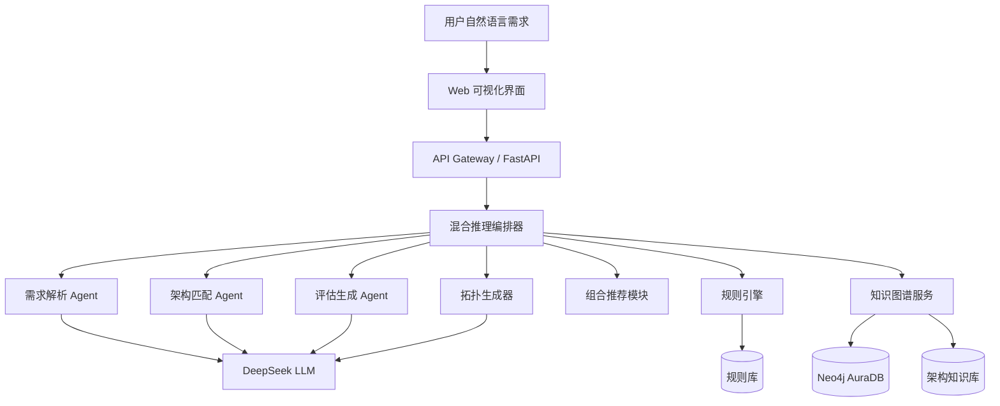
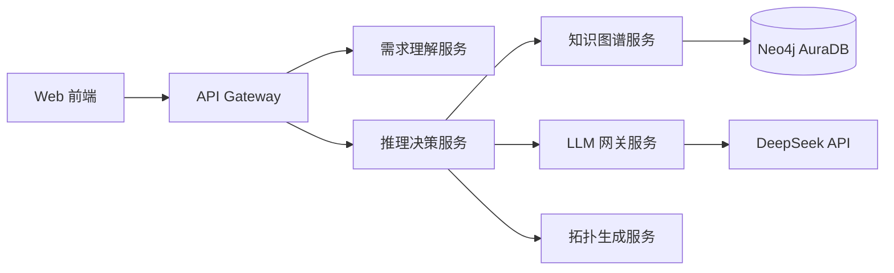
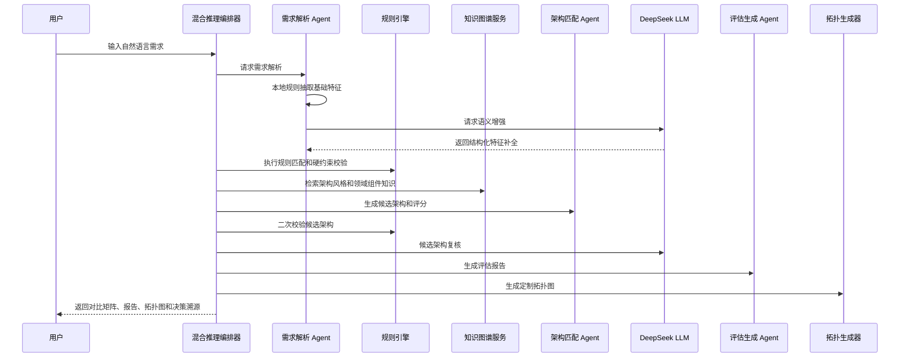
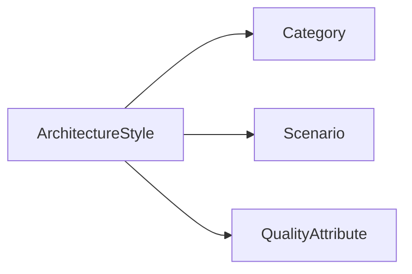
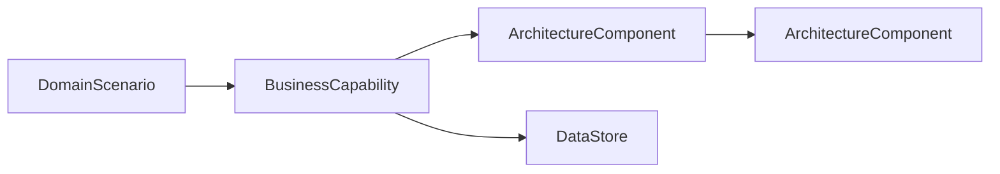

# ArchWise 架构设计文档

## 1. 设计目标

ArchWise 的目标是实现一个“软件体系结构风格智能助手”。系统需要接收用户自然语言需求，自动完成需求理解、候选架构推荐、多维度对比、最终评估报告、组合架构建议和定制拓扑图生成。

架构设计重点包括：

- 使用多 Agent 协作完成需求解析、架构匹配和评估生成。
- 集成 DeepSeek 大语言模型，增强自然语言理解和报告生成能力。
- 使用规则引擎进行硬约束校验，提升推荐可靠性。
- 使用 Neo4j AuraDB 构建架构知识图谱，支持架构风格、领域能力和组件关系扩展。
- 通过 Web API 和可视化页面展示推荐结果、对比矩阵、决策溯源和拓扑图。

## 2. 总体架构

系统采用“微服务思想 + 多 Agent 协作 + LLM/知识图谱双驱动”的架构。当前版本以一个 FastAPI 应用进行演示部署，但内部已经按照服务边界进行模块划分，后续可以拆分为独立微服务。



## 3. 逻辑分层

系统逻辑上分为四层：

| 层次 | 职责 |
| --- | --- |
| 交互层 | 提供 Web 页面和 API 接口，接收需求并展示推荐结果 |
| 编排层 | 负责组织 Agent、规则引擎、LLM、知识图谱和拓扑生成流程 |
| 推理层 | 完成需求解析、规则校验、架构匹配、组合推荐和报告生成 |
| 知识层 | 提供架构风格知识、领域能力知识、组件拓扑关系和案例数据 |

## 4. 微服务划分设计

当前系统部署为单体 FastAPI 应用，但按照微服务边界进行了模块化设计。后续可拆分为以下服务：

| 微服务 | 主要职责 |
| --- | --- |
| API Gateway 服务 | 统一接收前端请求，转发推荐、知识库、状态检查等请求 |
| 需求理解服务 | 解析自然语言需求，抽取结构化特征 |
| 推理决策服务 | 编排规则引擎、知识图谱和候选架构评分 |
| 知识图谱服务 | 管理架构风格、领域能力、组件关系和案例知识 |
| LLM 网关服务 | 封装 DeepSeek API 调用，统一处理超时、降级和流式输出 |
| 可视化服务 | 展示对比矩阵、决策溯源、Agent 追踪和 Mermaid 拓扑图 |

拆分后的调用关系如下：



## 5. 智能体协作机制

系统采用多 Agent 链式协作机制。每个 Agent 负责一个相对独立的推理阶段，由混合推理编排器统一调度。

### 5.1 Agent 角色划分

| Agent / 模块 | 职责 | 输出 |
| --- | --- | --- |
| 需求解析 Agent | 理解用户需求，提取领域、关键词、质量属性、数据流和约束 | 结构化需求特征 |
| 架构匹配 Agent | 根据需求特征、规则偏好和知识图谱结果生成候选架构 | 候选架构列表和评分 |
| 评估生成 Agent | 生成最终推荐报告、优缺点分析和落地建议 | 结构化评估报告 |
| 规则校验模块 | 校验候选架构是否违反硬约束，生成扣分原因 | 规则证据和校验结果 |
| 组合推荐模块 | 判断是否需要组合架构，并明确各架构模式职责 | 组合推荐结果 |
| 拓扑生成模块 | 根据需求、图谱组件和组合职责生成定制拓扑图 | Mermaid 拓扑图 |

### 5.2 Agent 协作流程



### 5.3 协作特点

- 需求解析 Agent 不直接决定最终架构，只负责生成结构化特征。
- 架构匹配 Agent 不完全依赖 LLM，而是综合规则、知识图谱和质量属性评分。
- 评估生成 Agent 主要负责表达和总结，最终推荐依据来自前序推理结果。
- 规则引擎贯穿前后两次校验，防止候选架构明显不符合需求。
- 决策溯源记录每个阶段的证据，便于解释推荐结果。

## 6. DeepSeek LLM 集成方案

### 6.1 集成定位

DeepSeek 在系统中不是唯一决策源，而是作为语义理解和报告生成能力的增强组件。

DeepSeek 主要参与四个环节：

| 环节 | 作用 |
| --- | --- |
| 需求特征增强 | 将模糊自然语言补全为结构化需求特征 |
| 候选架构复核 | 对候选架构排序给出补充风险和评审意见 |
| 报告生成 | 生成面向用户的架构评估说明 |
| 拓扑能力补充 | 从需求中提取领域业务能力，辅助拓扑生成 |

### 6.2 调用方式

系统使用 DeepSeek 兼容 OpenAI Chat Completions 的接口形式：

```text
POST https://api.deepseek.com/chat/completions
Authorization: Bearer <API_KEY>
Content-Type: application/json
```

主要请求参数包括：

```json
{
  "model": "deepseek-chat",
  "messages": [],
  "temperature": 0.1,
  "stream": false,
  "response_format": {
    "type": "json_object"
  }
}
```

报告生成场景开启流式输出：

```json
{
  "model": "deepseek-chat",
  "messages": [],
  "temperature": 0.2,
  "stream": true
}
```

### 6.3 需求特征抽取

LLM 需求特征抽取采用结构化 JSON 输出，字段包括：

```json
{
  "domain": "即时通信",
  "keywords": ["万人在线", "实时消息", "视频通话"],
  "quality_attributes": {
    "concurrency": 0.85,
    "realtime": 0.9,
    "reliability": 0.75,
    "scalability": 0.8,
    "data_intensity": 0.4,
    "ai_reasoning": 0.0
  },
  "constraints": {
    "scale_mentions": ["万人"],
    "deployment": ["跨平台"],
    "requires_high_availability": true,
    "requires_future_extension": true
  },
  "data_flow": "event_stream",
  "ambiguity_notes": ["未明确消息延迟指标", "未明确部署环境"]
}
```

系统会使用结构化 Schema 校验 LLM 输出。如果 LLM 不可用、超时或返回格式不合法，则回退到本地规则解析结果。

### 6.4 报告流式输出

评估报告通过 Server-Sent Events 流式返回。用户点击“生成推荐”后，系统先返回需求特征、候选架构和对比矩阵，再持续返回报告片段。

流式输出的优点：

- 减少用户等待感。
- 报告生成过程更加自然。
- 拓扑图生成可与报告生成并行执行。

### 6.5 LLM 降级策略

系统设计了 LLM 降级机制：

- 未配置 API Key：使用本地规则和模板报告。
- LLM 超时：保留规则引擎和知识图谱结果。
- JSON 解析失败：丢弃 LLM 特征增强结果，使用本地结构化特征。
- 流式报告失败：使用评估生成 Agent 的模板分析内容。

这种设计可以保证系统即使没有 LLM 也能完成基本推荐流程。

## 7. 混合推理机制

系统采用“规则引擎 + DeepSeek LLM + Neo4j 知识图谱”的混合推理机制。

### 7.1 推理原则

- LLM 负责理解模糊语义，不直接控制最终评分。
- 规则引擎负责硬约束、扣分和结果校验。
- 知识图谱负责提供可扩展的领域知识和组件关系。
- 架构匹配 Agent 负责综合多源证据生成候选排序。

### 7.2 推理流程

```text
用户需求
  -> LLM/规则提取结构化特征
  -> 规则引擎命中硬约束和偏好规则
  -> 知识图谱检索候选架构和领域组件
  -> 架构匹配 Agent 计算候选评分
  -> 规则引擎二次校验候选合理性
  -> LLM 复核候选架构风险
  -> 生成对比矩阵和最终报告
```

### 7.3 规则引擎作用

规则引擎用于保证推荐可靠性，主要包括：

- 高并发场景优先考虑微服务、事件驱动等架构。
- 强实时事件流场景优先考虑事件驱动架构。
- 简单 CRUD 场景避免推荐复杂组合架构。
- 高安全场景降低不适合架构的推荐权重。
- 对违反硬约束的候选架构进行扣分和风险提示。

规则引擎不是第二套完整知识库，而是推荐可靠性的校验器和兜底器。

### 7.4 评分机制

候选架构评分综合以下因素：

- 架构风格自身质量属性能力。
- 需求质量属性强度。
- 规则引擎偏好与拒绝结果。
- 知识图谱场景匹配结果。
- 数据流类型匹配度。
- 架构复杂度和过度设计风险。
- 候选架构之间的相对分差。

评分结果会保留扣分原因和置信度，避免所有候选架构都出现相同高分。

## 8. 知识图谱设计

系统知识图谱分为两类：

### 8.1 架构风格知识图谱

用于描述架构风格本身。



主要节点：

- ArchitectureStyle：架构风格
- Category：架构类别
- Scenario：适用场景
- QualityAttribute：质量属性

主要关系：

- BELONGS_TO：架构属于某类别
- SUITABLE_FOR：架构适用于某场景
- HAS_SCORE：架构在某质量属性上的评分

### 8.2 领域拓扑知识图谱

用于支持定制拓扑图生成。



主要节点：

- DomainScenario：领域场景，如即时通信、在线教育、电商、物联网
- BusinessCapability：业务能力，如消息通信、直播、支付、订单管理
- ArchitectureComponent：架构组件，如 API 网关、消息服务、事件总线
- DataStore：数据存储，如消息库、订单库、对象存储

主要关系：

- REQUIRES：领域场景需要某业务能力
- IMPLEMENTED_BY：业务能力由组件实现
- USES_STORE：业务能力使用数据存储
- STORES_IN：组件写入或读取数据存储
- DEPENDS_ON：组件之间存在依赖或事件关系

## 9. 架构组合推荐设计

组合推荐用于处理单一架构风格无法完整覆盖复杂需求的情况。

系统通过 `composition_needed` 字段判断是否需要组合架构：

```json
{
  "composition_needed": true,
  "primary_style": "事件驱动架构",
  "supporting_styles": [
    {
      "style": "微服务架构",
      "role": "服务拆分与独立扩展",
      "apply_to": ["用户服务", "消息服务", "媒体服务"]
    }
  ]
}
```

触发组合推荐的典型条件：

- 高并发与高实时性同时存在。
- 业务扩展性诉求明显。
- 数据处理链路较重。
- 读写压力差异明显。
- 前两名候选架构分差较小。

避免组合推荐的条件：

- 系统规模较小。
- 并发和实时性要求较低。
- 典型 CRUD 管理系统。
- 单一候选架构优势明显。

## 10. 拓扑生成设计

定制拓扑图不是静态模板，而是根据本次需求动态生成。

拓扑生成输入包括：

- 用户需求
- 结构化需求特征
- 最终推荐架构
- Neo4j 检索到的领域能力、组件和依赖关系
- DeepSeek 补充的业务能力
- 规则引擎补齐的基础设施
- 架构组合推荐结果

拓扑生成策略：

- 当 Neo4j 返回组件知识时，以 Neo4j 为主知识源。
- 本地规则只负责入口、负载均衡、缓存、事件总线、监控、审计等必要组件补齐。
- 对 API 网关、事件总线、缓存集群、对象存储等全局基础设施执行单例去重。
- 当存在组合架构时，在拓扑图中增加“架构模式职责”层。

职责映射示例：

```text
事件驱动架构 -> 事件总线 / 消息服务 / 通知服务
微服务架构 -> 用户服务 / 消息服务 / 媒体服务
CQRS 架构 -> 消息库 / 状态缓存 / 搜索索引
```

这种设计使“架构组合推荐”和“定制拓扑图”保持一致，避免只画组件而看不出架构模式分工。

## 11. 决策溯源设计

系统为每次推荐生成结构化 `decision_trace`，用于解释推荐过程。

溯源信息包括：

- 需求特征证据
- 规则命中证据
- 知识图谱匹配证据
- 候选架构评分证据
- LLM 复核意见
- 组合推荐证据
- 拓扑生成证据
- 最终推荐理由

前端通过折叠面板展示这些证据，便于用户在答辩或演示中说明系统的推理过程。

## 12. 并行与流式响应设计

为了提升用户体验，系统采用异步并行策略：

- 报告生成由 DeepSeek 以流式方式返回。
- 拓扑图生成与报告生成并行执行。
- 页面先展示候选架构、对比矩阵和需求特征。
- 拓扑图完成后单独推送到前端。

该设计避免用户长时间等待完整结果，提高交互体验。

## 13. 可靠性设计

系统通过以下方式提升推荐可靠性：

- LLM 输出必须经过结构化校验。
- 规则引擎对候选架构进行二次校验。
- 高风险架构不会被直接删除，而是通过扣分和风险提示体现。
- Neo4j 返回组件后仍进行单例去重和边合法性校验。
- LLM 不可用时使用本地规则和模板兜底。
- 决策溯源保留每个阶段的证据。

## 14. 与作业要求的对应关系

| 作业要求 | 系统设计 |
| --- | --- |
| 需求理解模块 | 需求解析 Agent + DeepSeek 特征增强 + 结构化 Schema |
| 知识库模块 | 架构风格知识库 + Neo4j 领域拓扑知识图谱 |
| 推理决策模块 | 规则引擎 + DeepSeek LLM + 知识图谱 + 架构匹配 Agent |
| 可视化模块 | 对比矩阵、评估报告、决策溯源、Agent 追踪、Mermaid 拓扑图 |
| 至少 3 类智能体 | 需求解析 Agent、架构匹配 Agent、评估生成 Agent |
| 集成大语言模型 | DeepSeek API，用于特征增强、候选复核、报告生成和能力补充 |
| 支持知识进化 | 支持扩展架构风格、案例、领域能力、组件和拓扑关系 |

## 15. 小结

ArchWise 的架构设计重点不是让 LLM 单独完成推荐，而是通过多 Agent 协作，把 LLM 的语义理解能力、规则引擎的可靠性约束和 Neo4j 知识图谱的可扩展知识组织能力结合起来。

这种设计既能处理自然语言需求的模糊性，又能保证架构推荐过程具有可解释性、可追溯性和可扩展性。
